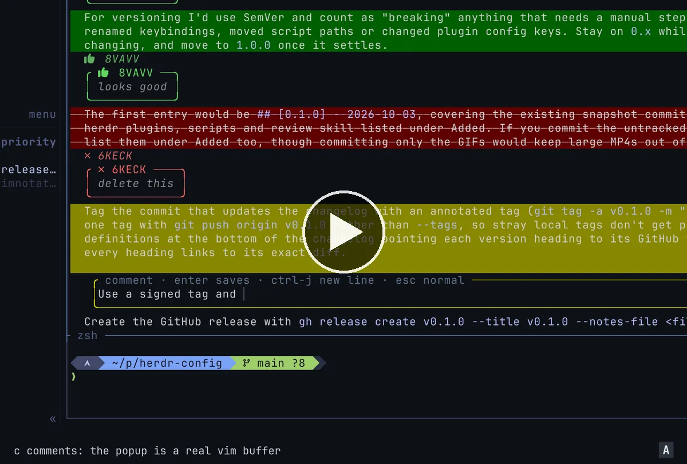

# herdr-vimnotate

[](https://github.com/user-attachments/assets/6ffeb5cf-e4a9-4b0c-bb55-fe7a231a98a9)

Press `prefix+a` to switch to annotation mode for the focused Herdr pane, using neovim under the hood. You can review and annotate an agent's reply with vim motions for three operations (the keys are [configurable](#configuration)):
1. `c` is comment
2. `d` is delete (remove this)
3. `p` is plus (looks good)

So, for example, `cap` comments on a paragraph, `dap` marks one for deletion, `pp` says a line looks good, `.` repeats the last one.

Once you're done, press `q` to send the whole review back as one message, sitting unsubmitted in the agent's composer.

While this plugin ~~copies~~ takes inspiration from the [plannotator herdr annotation plugin](https://github.com/plannotator/herdr-annotate) for some of the UI/UX, it is meant to feel more like a built-in mode similar to herdr's copy mode (`prefix+[`) instead of a different TUI. All while giving you those sweet sweet vim motions, of course.

Currently **0.x**: I use it daily with my own herdr & neovim config, would love to hear feedback and any issues you run into if you try it, who knows maybe we'll even do 1.0 some day!

## Install

```sh
herdr plugin install aksh1618/herdr-vimnotate
```

Then bind it, in herdr's `config.toml`:

```toml
[[keys.command]]
key = "prefix+a"
type = "plugin_action"
command = "aksh1618.vimnotate.open"
description = "Vimnotate: annotate thread in nvim"
```

To hack on it, clone the repo and `herdr plugin link <path>` instead.

## Requirements

- herdr **0.9.0+** (what it's built and tested on)
- neovim **0.11+** (for floating-window mouse support; developed on 0.12)
- `bash`, `jq`, `socat`, `awk`, and `sha256sum` or `shasum`
- `wl-copy`/`wl-paste`, `xclip`, `xsel` or `pbcopy`/`pbpaste` for the clipboard fallback and the clipboard anchor (optional)

The manifest lists macOS and the scripts avoid GNU-only tools, but it has only been run on Linux. Why these minimums: [docs/how-it-works.md](docs/how-it-works.md#minimum-versions).

## Flow

1. `prefix+a`. The thread opens in place, scrolled to the bottom, in a read-only buffer.
2. Navigate like neovim; Annotate with the c/d/p operators (more operators below). Or just use your mouse.
3. Each annotation is a coloured highlight over its range plus a box under it with your comment (or, with `R`, a bubble in a side rail).
4. `q` (or `:qa`, or `:Send`) once you're done.
5. The target pane comes back and the review is pasted into its composer **unsubmitted**, so you read it back and press Enter yourself.
6. `:Cancel` throws the review away.

Already selected something in herdr's copy mode? Press `prefix+a` with the selection still active and vimnotate opens with the comment popup on that text. If it can't find the text in the thread, it quotes it into the general note instead.

Selected it with the mouse instead? herdr copies it to the clipboard, so `prefix+a` opens the comment popup on that text too, as long as it's in the thread ([how](docs/how-it-works.md#the-clipboard-anchor)).

## Keymap

In the thread:

| Key | What it does |
| --- | --- |
| `c{motion}`, `cc`, `C`, visual `c` | Comment. Opens a compose popup below the range. `C` is the comment key in upper case, when that key is free. |
| `d{motion}`, `dd`, visual `d` | Mark for deletion ("Remove this."), with an optional reason. |
| `p{motion}`, `pp`, visual `p` | Mark as looking good ("Looks good."). |
| `.` | Repeat the last operator on a new range. Counts work too (`3cc`). |
| `e` / `x` / `K` | Edit / remove / show the annotation under the cursor. |
| `]a` / `[a` | Next / previous annotation. If nvim-treesitter-textobjects is installed they register with its `repeatable_move`, so its `;` and `,` repeat them. |
| `u` / `<C-r>` | Undo / redo annotation changes (add, remove, edit, kind change), one step per keypress. |
| `<C-o>` / `<C-i>` | The jumplist, confined to the thread: it starts empty and can't walk into other files. |
| `R` | Cycle the view: inline boxes → side rail → off. |
| `<S-Tab>` | Focus the side rail. |
| `<Tab>` | Open the general note, a popup whose text is sent above the annotations. |
| `q` | Send and quit. |

- The `c`, `d` and `p` keys can be changed in [Configuration](#configuration).
- Operators add a new annotation, even over an existing one; `e` is how you edit. The exceptions are on exactly an existing annotation's range:
  - `d` or `p` where one of the same kind is already there adds nothing; a [restored](#what-gets-sent) one becomes pending again.
  - `d`, `p` or `c` on a restored annotation of another kind changes its kind and makes it pending again; `c` opens the compose popup on it.
  - `c` on a comment adds another comment, whether that comment is restored or not.
- Motions and text objects are vim's own, so `w`, `ap`, `}` and whatever text objects your config adds all work.
- The comment compose popup is an ordinary vim buffer: `Enter` saves (in insert or normal mode), `Ctrl-j` inserts a new line, `Esc` goes to normal mode and `q` there cancels.
- The note popup is a plain buffer too, but `Enter` is just a newline. `q` or `Tab` in normal mode hides it, and so does clicking back into the thread. Hiding never discards the note; only `:Cancel` does.
- In the side rail: `j`/`k` move between annotations, `Enter` jumps to one in the thread, `e` edits, `x` removes, `Esc` or `Tab` goes back to the thread.
- A visual selection (keyboard or mouse drag) shows an action bar with clickable "looks good", "comment" and "delete" labels. Resting the cursor on an annotation shows a hint bar for `e`, `x` and `K`.

## What gets sent

The general note first, then each annotation as a quote of the text it covers followed by the reply, separated by blank lines:

```
Overall fine, but keep it shorter.

> For versioning I'd use SemVer.

Looks good.

> Tag the commit with an annotated tag.

Use a signed tag and push only that one

> Add a GitHub Action later.

Remove this.
```

A comment line starting with `>` is sent as `\>`, so it never reads as quoted text.

When the agent's composer is recognisably empty, the review is pasted as-is; a dimmed placeholder such as Codex's `Ask Codex to do anything` counts as empty. Otherwise, and whenever vimnotate [can't tell](#does-it-edit-my-neovim-config), it's separated from whatever is already in the composer, by a blank line for a multi-line review or a space for a one-liner, so a second review never glues onto unsent text.

When you send, the annotations are saved for that pane. Open the same pane again and they're found again in the new capture and shown dimmed, marked as sent. They're left out of the next send unless you edit or re-mark one, which makes it pending again; `x` removes one for good. How they're matched and where the state lives: [docs/how-it-works.md](docs/how-it-works.md#restoring-sent-annotations).

## Configuration

Settings go in `config.toml` in vimnotate's herdr plugin config directory. To find it:

```sh
herdr plugin config-dir aksh1618.vimnotate
```

That's usually `~/.config/herdr/plugins/config/aksh1618.vimnotate/`. Every key is optional; this is the full set, at the defaults:

```toml
# "inline" boxes under each range, "rail" a side rail, "auto" the rail when the thread still keeps 80 columns (else inline), "off" highlights only. R switches at runtime.
view = "inline"

# "always" shows the action bar for every visual selection, "mouse" only for mouse selections, "never" not at all.
action_bar = "always"

# false doesn't show sent annotations again, but still keeps them saved.
restore = true

# How much scrollback to capture, from 1 to 1000. 1000 is also the most `pane read --lines` returns.
lines = 1000

# true sends a multi-line review to a pane with no agent anyway (see docs/how-it-works.md#sending).
force_send = false

# The operator keys. Each is one key: {key}{motion} on a motion or text object, doubled for the current line, the key itself in visual mode.
[keys]
comment = "c"     # its uppercase (C) also comments to the line, when that key is free
delete = "d"
looks_good = "p"
```

- It's read each time vimnotate opens, so changes apply to the next review without restarting herdr. A review that's already open keeps the settings it started with.
- Only `key = value` lines are understood: strings in double quotes, `true`/`false`, whole numbers and `#` comments.
- Unknown keys/values are ignored.
- An operator key is one character that isn't already a key used by vimnotate. See [how it works](docs/how-it-works.md#keys) for the exact rules.

## FAQ

### How does it work?

How the pane's slot is taken and given back, how the thread is rendered, how the review is sent, how sent annotations are matched again, and how to run the tests: [docs/how-it-works.md](docs/how-it-works.md).

### Where did my agent pane go?

While you annotate, the agent pane is parked in a tab of its own, named `<tab> [parked by vimnotate]`, and the tab you're annotating in is renamed `vimnotate: <tab>`. If you navigate away and click the agent to come back, you land in the parked tab; your annotations are in the `vimnotate:` tab. When vimnotate exits the parked tab closes and your tab gets its name back (unless you renamed it yourself while vimnotate was still running).

### Does it share anything with my everyday neovim?

vimnotate loads your neovim config, but a review session keeps neovim's own state apart from your other neovim sessions:

- nvim runs with `-i NONE` (no ShaDa), so a review never adds its searches, commands or yanked thread text to your history and registers, and your jumplist and old files never leak into the thread (`<C-o>` can't walk into them).
- `undofile` is off, so review text never lands in your undo directory. Swap files are off too.
- The clipboard is shared. If your config sets `clipboard=unnamedplus`, yanks in a review reach the system clipboard, and pasting in a popup reads from it.
- Anything a plugin in your config keeps outside ShaDa (its own history or session files, say) behaves as in any other neovim; vimnotate doesn't isolate it.
- The capture lives in a `mktemp -d` directory that is removed on exit. Only these are kept:
  - the [restore](#what-gets-sent) state;
  - a hash of clipboard text that anchored a review, so it anchors only once;
  - the whole directory, captures included, when a send fails and there's no clipboard tool, so the review isn't lost.

### Does it edit my neovim config?

No. The plugin needs to override some neovim config to work well, but only inside the review's own nvim process: your config files aren't touched, and any other neovim you open, even mid-review, is unaffected. This is likely the least portable part, and the most susceptible to config-specific breakage. File an issue if you run into anything!

- Global maps that would make its keys ambiguous are deleted for the length of the session. A global `cs` (surround plugins) or `]ab` makes `c` or `]a` wait out `timeoutlen` before deciding, and a buffer-local exact match does *not* escape that wait. They're re-checked after every lazy.nvim `LazyLoad`, since a lazy-loaded plugin can map them later.
- Global left-mouse maps are deleted and `mouse=a` is forced, since the drag-select gesture needs the mouse.
- `lualine` is hidden if present, and `laststatus=0` is kept.
- The thread window's `winhighlight` maps `WinBar` to `VimnotateWinbar`, and `MsgArea` links to `VimnotateMsgArea` (see [Can I change the colours?](#can-i-change-the-colours)).
- The compose and note popups are `filetype=markdown`, which pulls in whatever markdown stack is loaded. It's pre-warmed on a throwaway buffer so it doesn't load inside the first keypress.
- The compose popup turns off `breakindent` and `showbreak` and uses your global `tabstop`, overriding those settings from a markdown ftplugin. In the inline view, this makes its text wrap like the box it turns into. Tabs at or after a wrap boundary can still produce different spacing or wrapping.
- The empty-composer check is a heuristic that recognises the composer shapes of Claude Code, pi and Codex: a single line between the last two coloured horizontal rules with only coloured text below them (Claude Code, pi), or a `›` prompt at the start of a line through its shaded block (Codex). It's empty when that holds nothing but faint text and Claude Code's leading `❯` or Codex's `›`. Other agents, and anything it isn't sure of, get a leading blank line above the annotations (a space before a one-line review).

### Can I change the colours?

The top bar's badge and tint are the highlight groups `VimnotateMode` and `VimnotateWinbar`, and `VimnotateMsgArea` tints the bottom row when `cmdheight` is above 0. vimnotate doesn't override a group that's already set, so set yours in your neovim config ([defaults and details](docs/how-it-works.md#colours)):

```lua
vim.api.nvim_set_hl(0, "VimnotateMode", { fg = "#1a1b26", bg = "#7aa2f7", bold = true })
```

## License

[Apache-2.0](LICENSE), the same as herdr.
